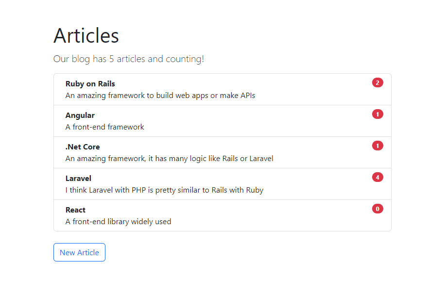
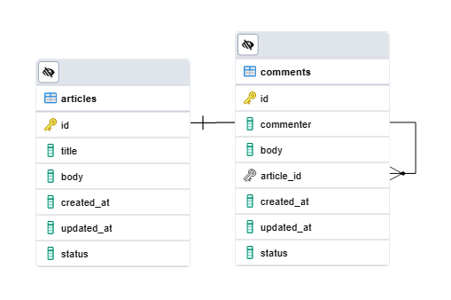
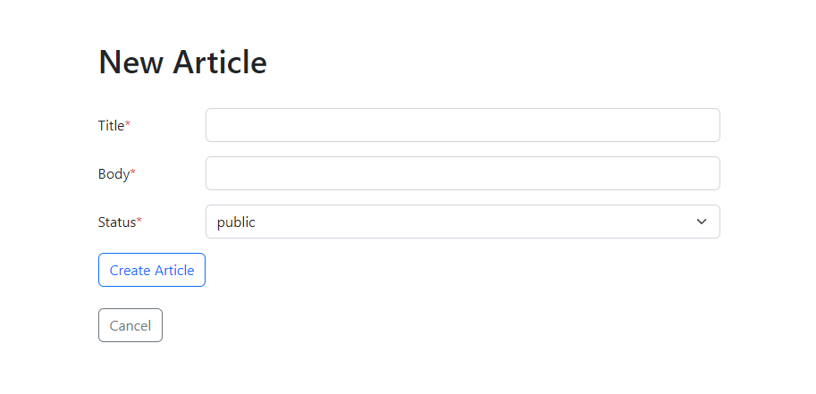
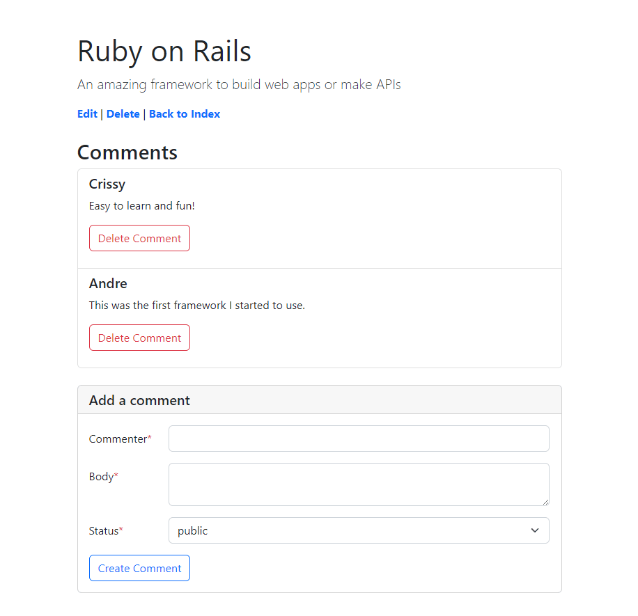

# Rails Blog

> Ruby on Rails web app.

This app was built following the [Getting Started](https://guides.rubyonrails.org/getting_started.html) section of the Ruby on Rails tutorial. The style was added as an extra step using Bootstrap.

This app uses two models: articles and comments, each article could have many comments. Each article has a title and a body. Each comment has the name of who write the comment and a text.

## Built With

- Ruby 2.7.6,
- Rails 6.1.6,
- PostgreSQL 13.2.2
- Bootstrap 5.2

## Getting Started

**To get a local copy up and running follow these simple next steps.**

### Prerequisites

- Ruby 2.7.6,
- Rails 6.1.6,
- PostgreSQL
- Get a copy using `git clone https://github.com/me-skit/rails_blog.git`

### Setup

**Once you get a copy, run the next instructions inside the project folder.**

- Run `bundle install` in order to get the project gems installed.
- Set up the right user and password for your database into the file `config/database.yml`.
- Create the database using the instruction `rails db:create`
- Run the project migrations through `rails db:migrate`.
- Start a local server using `rails server` or the short way `rails s`.
- Open a web browser and check how it works by typing `http://127.0.0.1:3000` in the address bar.

### Usage

Once you are running the project you will see a button to create a new article.

Once you have created some articles you will see their content and can write some comments.

## Author

👤 **Meme**

- Github: [@me-skit](https://github.com/me-skit)
- Linkedin: [linkedin](https://www.linkedin.com/in/manuel-elias/)

## 🤝 Contributing

Contributions, issues and feature requests are welcome!

Feel free to check the [issues page](https://github.com/me-skit/rails_blog/issues).

## Show your support

Give a ⭐️ if you like this project!

## 📝 License

This project is unlicensed.
